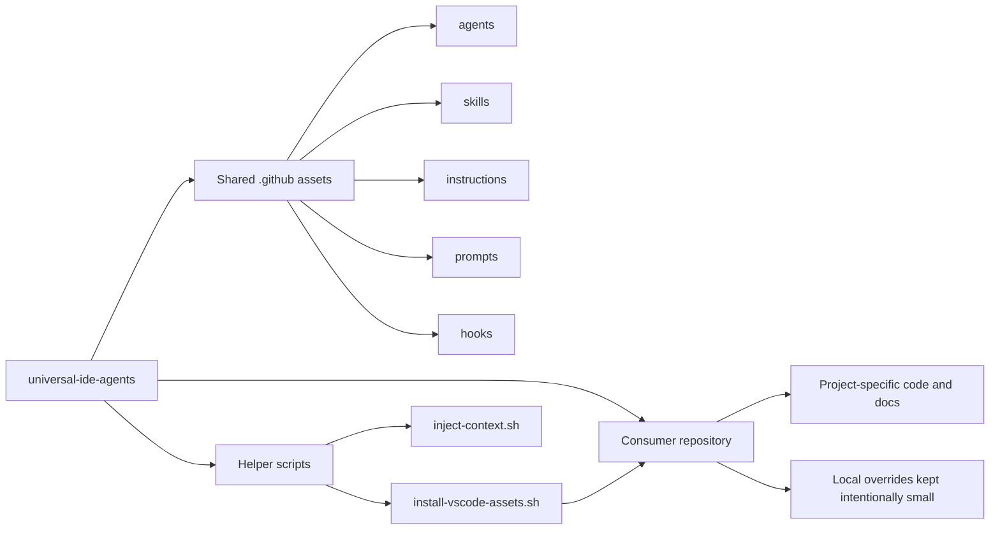

<!-- markdownlint-disable MD033 -->

# universal-ide-agents

<div align="center">

**A VS Code-first control room for reusable agents, skills, hooks, instructions, prompts, and helper scripts.**

[](./CHANGELOG.md) [](https://code.visualstudio.com/) [](./LICENSE) [](./docs/vscode-consumption.md)

## Social Media

[](https://www.youtube.com/@jsebastianbustos) [](https://github.com/Sebastian93BC) [](https://www.linkedin.com/in/sebastian-bustos-cordero-851a1421b/) [](https://x.com/bustos_cordero)

</div>

> [!IMPORTANT]
> `universal-ide-agents` is intentionally VS Code-first in `v0.1.0`. Other editors belong to the roadmap, not the current support matrix.

<table>
  <tr>
    <td width="33%" valign="top">
      <strong>Why This Exists</strong><br /><br />
      You should not rebuild agent behavior, documentation rules, hook wiring, and reusable prompts from scratch in every repository.
    </td>
    <td width="33%" valign="top">
      <strong>What This Ships</strong><br /><br />
      Reusable VS Code assets stored under <code>.github/</code> plus helper scripts that make those assets easy to install and maintain across projects.
    </td>
    <td width="33%" valign="top">
      <strong>How It Is Used</strong><br /><br />
      Add this repository as a secondary source, sync the shared assets into a target workspace, then keep project-specific behavior thin and local.
    </td>
  </tr>
</table>

## Release Notes at a Glance

| Stream | Status | What it means |
| --- | --- | --- |
| `main` | Stable | Publish-ready baseline for shared VS Code assets |
| `dev` | Active | Ongoing work for new agents, skills, docs, and scripts |
| `test` | Validation | Safe branch for trying new flows before they are promoted |

## The Model



## What Lives Here

| Asset type | Purpose | Current location |
| --- | --- | --- |
| Agents | Multi-step VS Code workflows for planning, implementation, review, and orchestration | `.github/agents/` |
| Skills | Task-specific guidance bundles that improve discovery and reuse | `.github/skills/` |
| Instructions | Always-on or file-scoped rules for consistent outputs | `.github/instructions/` |
| Prompts | Focused prompts for repeatable tasks | `.github/prompts/` |
| Hooks | Deterministic lifecycle automation for VS Code agents | `.github/hooks/` |
| Scripts | Portable shell helpers for setup, sync, and context injection | `scripts/` |
| Documentation | Catalog, consumption guide, roadmap, and release notes | `docs/`, `README.md`, `CHANGELOG.md` |

## Quick Start

The recommended integration path for `v0.1.0` is: keep this repository as a Git submodule or secondary checkout, then use the install script to copy the shared VS Code assets into the target workspace.

```bash
git submodule add git@github.com:Sebastian93BC/universal-ide-agents.git .config/universal-ide-agents
./.config/universal-ide-agents/scripts/install-vscode-assets.sh "$PWD"
```

Use `--dry-run` to preview changes and `--force` if you want the shared version to replace an existing asset.

```bash
./.config/universal-ide-agents/scripts/install-vscode-assets.sh --dry-run "$PWD"
./.config/universal-ide-agents/scripts/install-vscode-assets.sh --force "$PWD"
```

## Editorial View

### Latest Entry

#### March 27, 2026

The repository launches as a clean VS Code asset hub with:

- Rewritten repository instructions aligned to the actual project goal
- A normalized agent layer for planning, architecture review, implementation, and code review
- A helper script for installing shared assets into target repositories
- A helper script for session context injection via hooks
- A documentation baseline with release notes, catalog, and roadmap

## Repository Layout

```text
.
├── .github/
│   ├── agents/
│   ├── hooks/
│   ├── instructions/
│   ├── prompts/
│   ├── skills/
│   └── copilot-instructions.md
├── docs/
│   ├── asset-catalog.md
│   ├── roadmap.md
│   └── vscode-consumption.md
├── scripts/
│   ├── inject-context.sh
│   └── install-vscode-assets.sh
├── CHANGELOG.md
├── LICENSE
└── README.md
```

## Read the System

- [Asset catalog](./docs/asset-catalog.md)
- [VS Code consumption guide](./docs/vscode-consumption.md)
- [Roadmap](./docs/roadmap.md)
- [Changelog](./CHANGELOG.md)

## Versioning

This repository follows Semantic Versioning.

- `main` tracks the latest stable shared asset set.
- `dev` collects ongoing work.
- `test` exists for controlled validation before promotion.
- Tags should follow `vMAJOR.MINOR.PATCH`.

## Current Boundaries

This repository currently supports:

- VS Code custom agents
- VS Code prompts and instructions
- VS Code hook configuration
- Reusable shell helpers for installing and supporting those assets

This repository does not yet claim support for:

- JetBrains IDEs
- Zed
- Cursor
- Windsurf
- Generic cross-editor packaging

## Contribution Direction

If you extend this repository, optimize for one of these outcomes:

- Better reuse across multiple VS Code projects
- Safer automation and installation flows
- Stronger discoverability of the asset catalog
- Cleaner documentation and release discipline

## Footer

### Questions or improvements

- Use GitHub Issues for bugs, gaps, and enhancement requests.
- Use pull requests for new reusable assets or documentation refinements.
- Keep project-specific logic out of shared assets unless it is a documented extension point.

<div align="center">

**Build the workflow once. Reuse it everywhere.**

[](https://www.linkedin.com/in/sebastian-bustos-cordero-851a1421b/)

</div>
